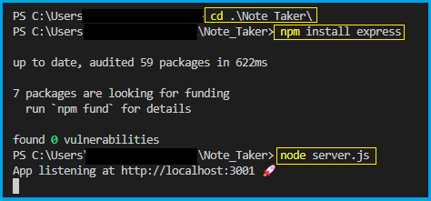
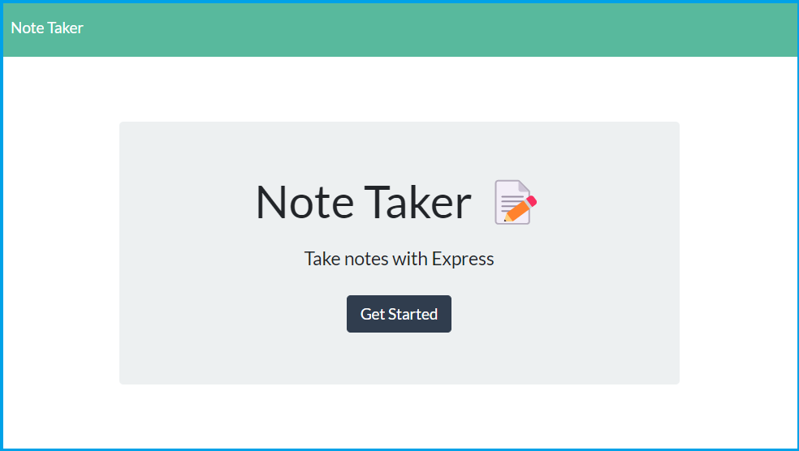
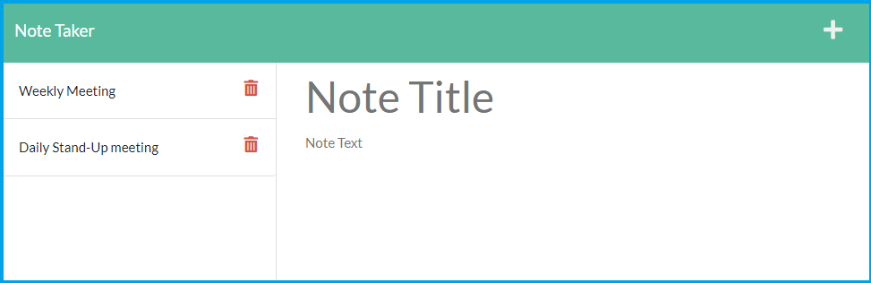
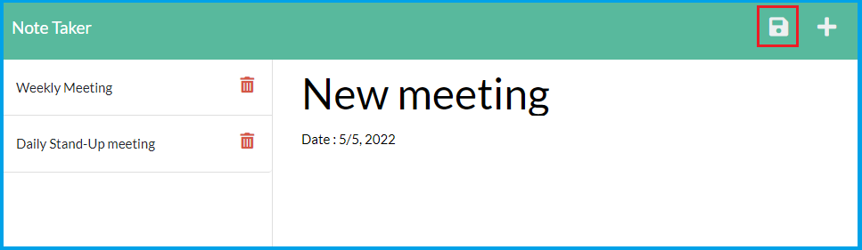
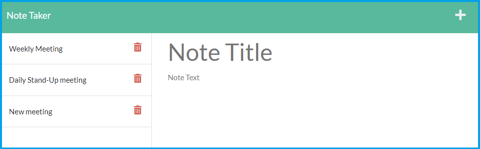
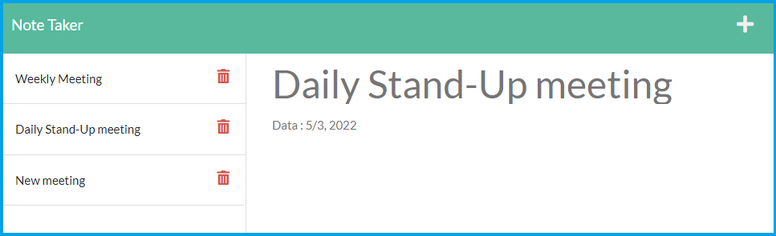
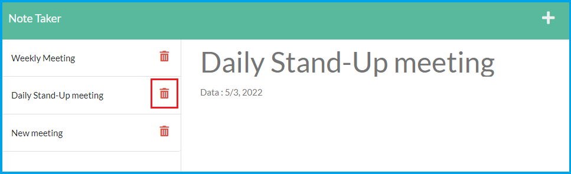
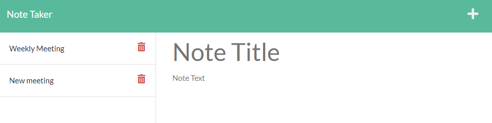

# Note Taker

## Description

This is a Note Taker application that can be used to write, save and delete notes.

- Use node.js to implement this application
- Use express.js back end 
- Deploy an application to Heroku
- Use nanoid.js to generate unique IDs
- Create a modular router for '/api/notes' path in notesRouter.js file

## Table of Contents
1. [Installation](#installation)
2. [Usage](#usage)
3. [License](#license)
4. [Contributing](#contributing)
5. [Test](#test)
6. [Questions](#questions)

## Installation

1. Move to the directory where index.js is
2. npm install express
3. node server.js

Please refer to the image below.

## Usage

1. When a user open the Note Taker, it shows a landing page with a link to a notes page

2. When a user clicks on the link to the notes page, it shows a page with existing notes listed in the left-hand column, plus empty fields to enter a new note title and the note's text in the right-hand column

3. When a user enters a new note title and the note's text, a save icon appears in the navigation at the top of the page

- When a user clicks on the save icon, the new note a user has entered is saved and appears in the left-hand column with the other existing notes

4. When a user clicks on an existing note in the list in the left-hand column, that note appears in the right-hand column

5. When a user clicks on the trash-can icon, that note will be deleted from the left-hand column

## License

Copyright (c) 2022 `wonjong2` (GitHub Username) Licensed under [the MIT License](https://choosealicense.com/licenses/mit/).

## Contributing

All your inputs are valuable and I love them.

- Reporting a bug
- Submiiting a fix
- Proposing new features

## Test

N/A

## Questions

1. GitHub: https://github.com/wonjong2
2. If you have any questions, please reach out to wonjong2@gmail.com
